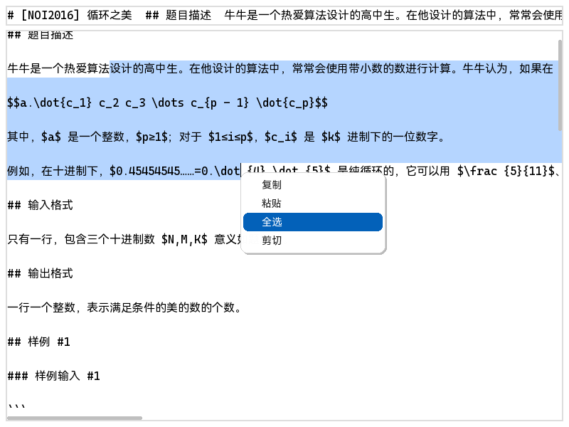

# Pygame 高级文本输入框 / Pygame Advanced Text Input Box



## Introduction

A high-performance, feature-rich text input box component developed with Pygame. Designed for Pygame applications requiring complex text input handling, supporting modern text editing features including multiline text, Chinese input, copy-paste, and more.

## Features

- **Copy/Paste/Cut/Select All**: Support for standard text operation shortcuts
- **Chinese Input Support**: Perfect support for Chinese and other multilingual input
- **Multiline Text Input**: Built-in custom scrollbar for long text editing
- **High Performance Rendering**: Optimized with prefix sum + binary search, maintaining 60+ fps even with 3000+ characters per line
- **Shortcut System**: Supports most common shortcuts with extensible interface
- **Beautiful Context Menu**: Fade-in/fade-out animations based on custom non-linear animation library
- **Cross-Platform Compatibility**: Good compatibility for both desktop and Android (Pydroid3)

## Requirements

- Python 3.7 or higher
- Pygame 2.5 or higher

## Installation

1. Ensure Python 3.7+ is installed
2. Install Pygame 2.5+:
   ```bash
   pip install pygame>=2.5.0
   ```
3. Copy project files to your project directory

## Quick Start

```python
import pygame
import sys
import os
from INS_text_input import TextInput


os.environ["SDL_IME_SHOW_UI"] = "1"

pygame.init()
screen = pygame.display.set_mode((800, 600))

pygame.key.set_repeat(450, 25)

clock = pygame.time.Clock()

input_box = TextInput(screen_rect=screen.get_rect(),
                      font=pygame.font.Font('CHSansSC.ttf', 16),
                      font_size=16, font_color=(0, 0, 0), line_height=24,
                      rect=pygame.Rect(10, 10, 780, 580),
                      init_text='Hello, World\nThis is a text input box', multi_lines=True)

while True:
    pygame_events = pygame.event.get()
    mouse_pos = pygame.mouse.get_pos()
    for event in pygame_events:
        if event.type == pygame.QUIT:
            pygame.quit()
            sys.exit()
    screen.fill((255, 255, 255))
    pygame.draw.rect(screen, (221, 221, 221), input_box.rect.inflate(4, 4), width=2)
    input_box.handle_events(pygame_events, mouse_pos)
    input_box.display(screen, mouse_pos)

    pygame.display.update()
    clock.tick(114514)
```

## Known Limitations

- Does not support Unicode bidirectional text control characters
- Does not support variant selectors
- Does not support combining character sequence rendering

## Performance Optimizations

This component employs multiple optimization techniques:
- Prefix sum algorithm for fast text measurement
- Binary search optimization for long text rendering
- Incremental updates to reduce unnecessary redraws

## License

GNU Affero General Public License v3.0

## Contributing

Issues and Pull Requests are welcome to improve this project.

---

## 简介

这是一个基于 Pygame 开发的高性能、功能丰富的文本输入框组件。专为需要复杂文本输入处理的 Pygame 应用程序设计，支持多行文本、中文输入、复制粘贴等现代文本编辑功能。

## 功能特性

- **复制/粘贴/剪切/全选**：支持标准的文本操作快捷键
- **中文输入支持**：完美支持中文及其他多语言输入
- **多行文本输入**：内置自制滚动条，支持长文本编辑
- **高性能渲染**：使用前缀和+二分查找优化，即使单行超过3000字符也能保持60fps以上
- **快捷键系统**：支持大部分常用快捷键，并提供扩展接口
- **美观的右键菜单**：带有淡入淡出动画效果，基于自定义非线性动画库
- **跨平台兼容**：对桌面端和安卓端（Pydroid3）都有良好的兼容性

## 技术要求

- Python 3.7 或更高版本
- Pygame 2.5 或更高版本

## 安装

1. 确保已安装 Python 3.7+
2. 安装 Pygame 2.5+：
   ```bash
   pip install pygame>=2.5.0
   ```
3. 将本项目的文件复制到您的项目中

## 快速开始

```python
import pygame
import sys
import os
from INS_text_input import TextInput


os.environ["SDL_IME_SHOW_UI"] = "1"

pygame.init()
screen = pygame.display.set_mode((800, 600))

pygame.key.set_repeat(450, 25)

clock = pygame.time.Clock()

input_box = TextInput(screen_rect=screen.get_rect(),
                      font=pygame.font.Font('CHSansSC.ttf', 16),
                      font_size=16, font_color=(0, 0, 0), line_height=24,
                      rect=pygame.Rect(10, 10, 780, 580),
                      init_text='Hello, World\nThis is a text input box', multi_lines=True)

while True:
    pygame_events = pygame.event.get()
    mouse_pos = pygame.mouse.get_pos()
    for event in pygame_events:
        if event.type == pygame.QUIT:
            pygame.quit()
            sys.exit()
    screen.fill((255, 255, 255))
    pygame.draw.rect(screen, (221, 221, 221), input_box.rect.inflate(4, 4), width=2)
    input_box.handle_events(pygame_events, mouse_pos)
    input_box.display(screen, mouse_pos)

    pygame.display.update()
    clock.tick(114514)
```

## 已知限制

- 不支持 Unicode 双向文本控制字符
- 不支持变体选择符
- 不支持组合字符序列渲染

## 性能优化

本组件采用了多种优化技术：
- 前缀和算法加速文本测量
- 二分查找优化长文本渲染
- 增量更新减少不必要的重绘

## 许可证

GNU Affero General Public License v3.0

## 贡献

欢迎提交 Issue 和 Pull Request 来改进这个项目。

